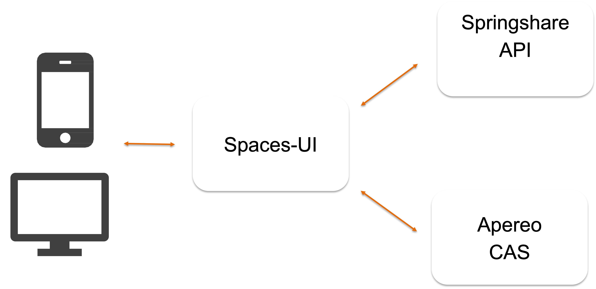
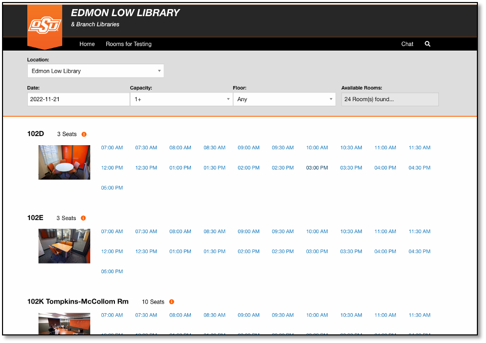
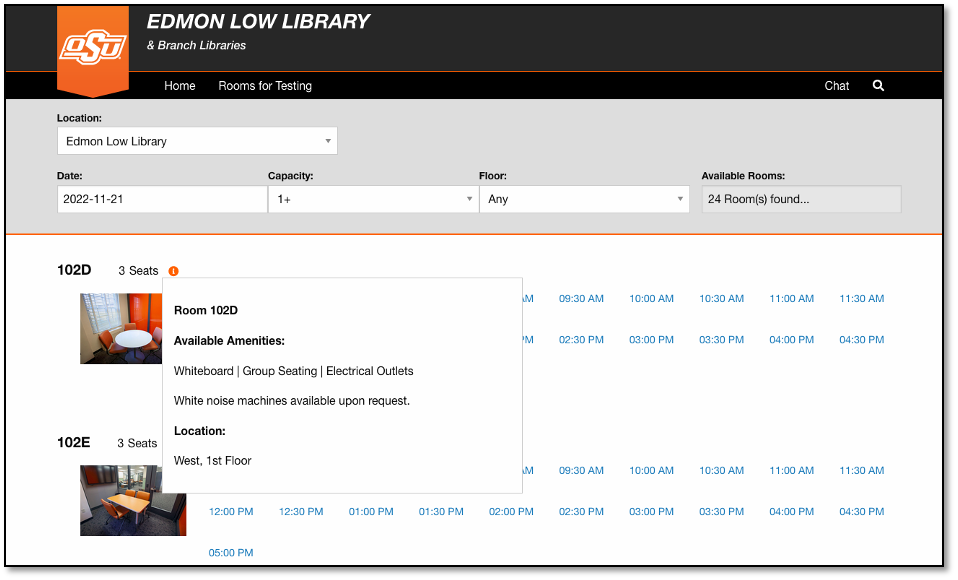
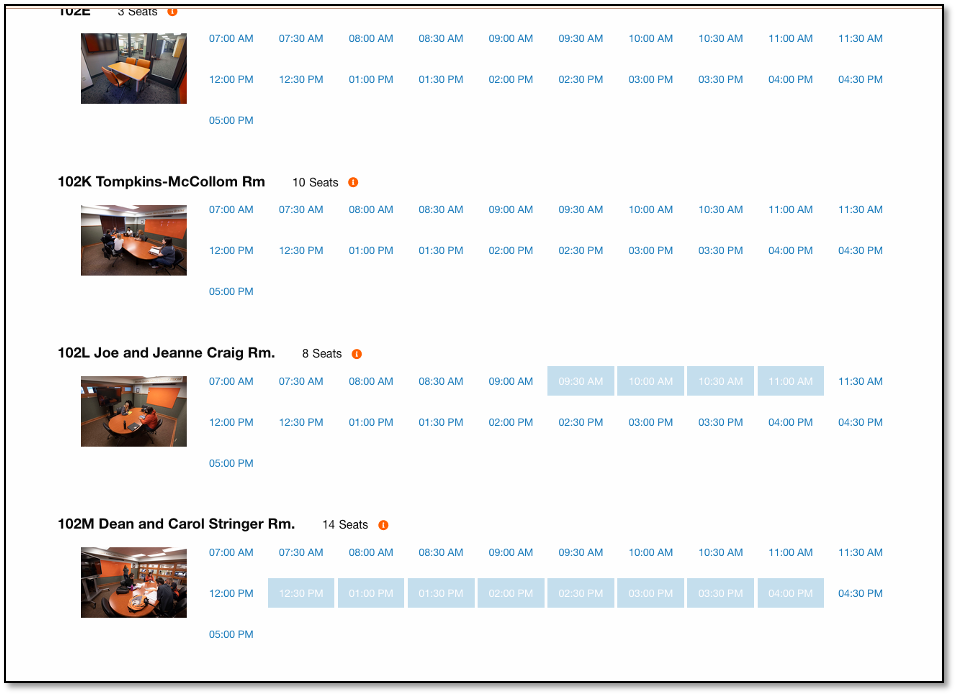
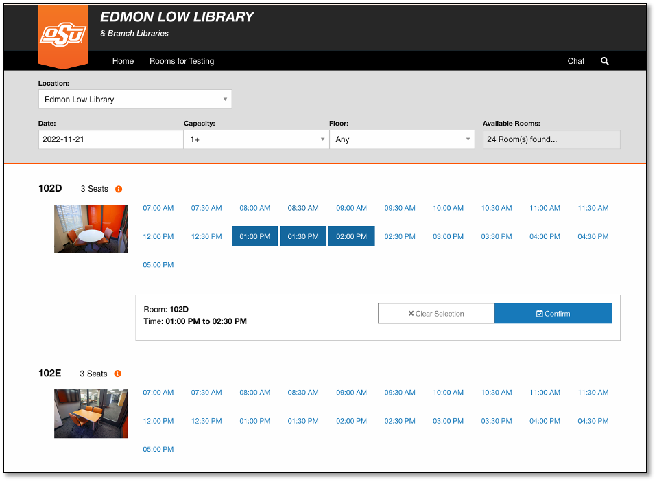
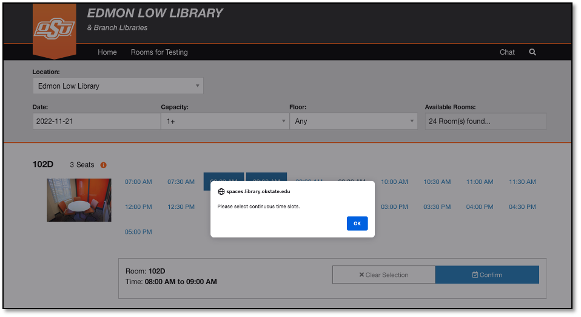
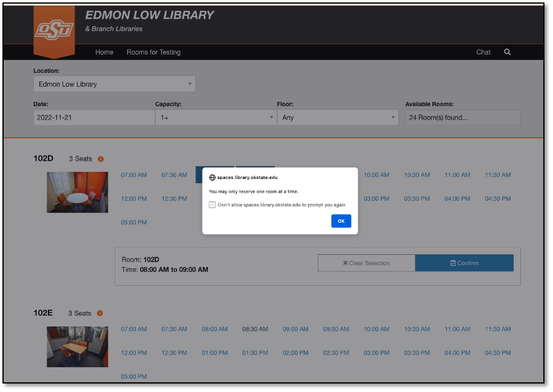
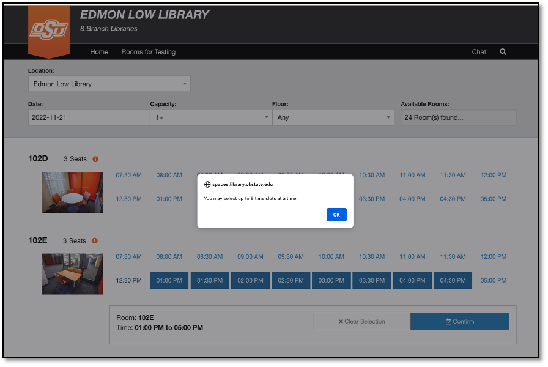
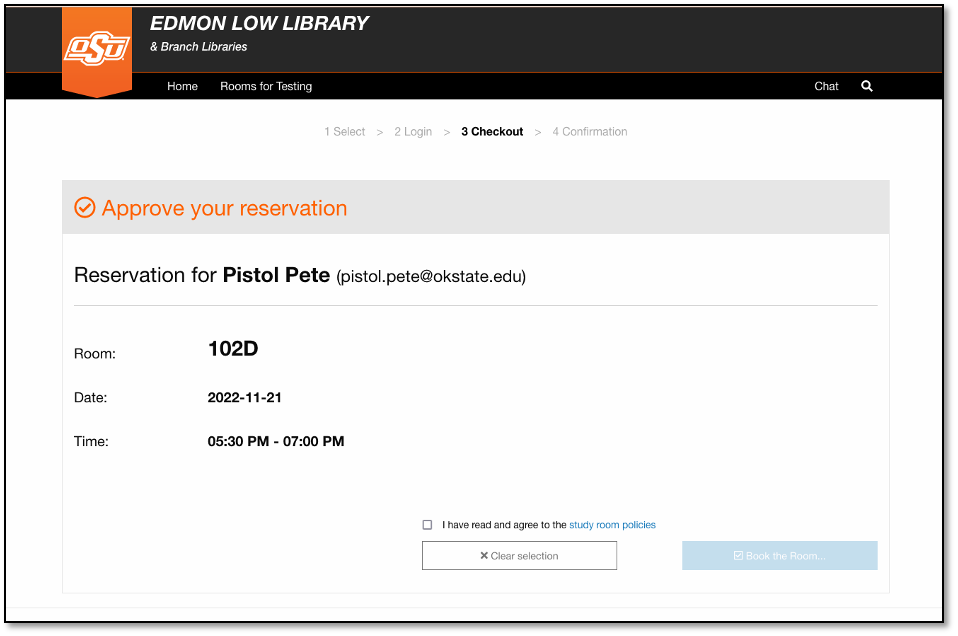
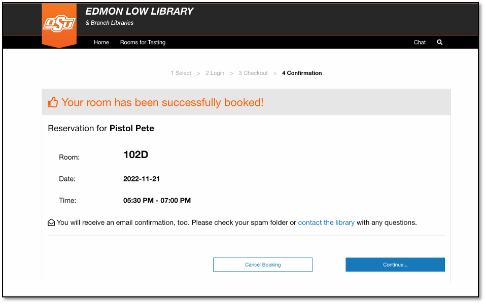

# spaces - ui

Spring Boot/ Spring Security/ REST/ JavaScript/ Single Sign On (Central Authentication System)

The project simulates a web application that enables patrons to perform all operations in Springshare Spaces. The application uses Springshare Spaces API and Apereo Single Sign-On to authenticate users when reserving rooms.

## Things to run the application.

__Clone the repository__
```
git clone https://github.com/okstate-library/spaces-ui.git
```
__Set Your settings in application.properties__

Change the following properties on [application.properties](../../blob/master/src/main/resources/application.properties)

1. springShareClientId= ? // Springshare client id
2. springShareSecretkey= ? //Springshare Key

3. idpMetadataURL= ? //Central Autentication System IDP MetadataURL
4. metadataEntityId= ? //Central Autentication System Metadata Entity ID

5. categoryId= ? //Default Spaces room category ID
6. locationId= ? //Default Spaces location ID


__Run the application__
```
mvn clean spring-boot:run
```
## Architecture.


## Screen shots.

### Main Page


### Displaying room amenities view


### Already book time slots view


### Selecting time slots view


### Error message - time slots selecting without continuity view   


### Error message - trying to reserve more than one room at a time


### Error message - trying to reserve more than 8 time slots


### Reservation approval Page


### Reservation confirmation page


## Build application and run on a live environment.

###### Build application
```
mvn clean build
```

###### Run application
```
java -jar target/spaces-ui-1.0.1.RELEASE
```

Check the URL "http://localhost:8080".
